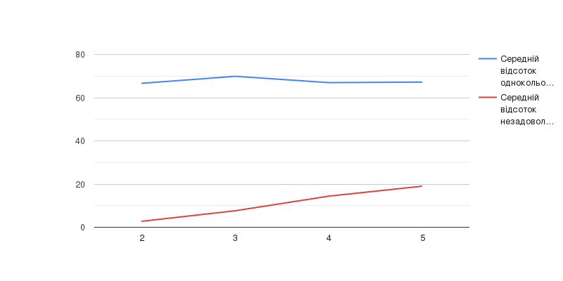

## Комп'ютерні системи імітаційного моделювання

## СПм-22-5, **Рибалов Олександр Олегович**

### Лабораторна робота №**1**. Опис імітаційних моделей та проведення обчислювальних експериментів

 

### Варіант 8, модель у середовищі NetLogo:

[Segregation Simple Extension 1.](http://www.netlogoweb.org/launch#http://www.netlogoweb.org/assets/modelslib/IABM%20Textbook/chapter%203/Segregation%20Extensions/Segregation%20Simple%20Extension%201.nlogo)

 

### Вербальний опис моделі:

Ця симуляція втілює взаємодію черепах різних видів в середовищі біля уявного ставу. У цій віртуальній екосистемі всі черепахи мають дружні стосунки одне з одним, проте кожна із них має власні вподобання, щодо їхнього оточення. Зокрема, кожна черепаха відчуває потребу мати серед своїх сусідів представників свого власного виду. Симуляція сприяє відображенню того, як індивідуальні вподобання впливають на розташування черепах у великому масштабі.

### Керуючі параметри:

-   **(NUMBER)**: Цей параметр визначає загальну кількість черепах, які будуть розміщені біля ставу під час налаштування (SETUP). Більше черепах може призвести до більш складної динаміки взаємодії між ними.

-   **(NUMBER-OF-ETHNICITIES)**: Кількість різних видів черепах: Цей параметр визначає кількість різних видів черепах у популяції, кожен з яких матиме свій унікальний колір. Він впливає на різноманітність черепах в ставі.

-   **(%-SIMILAR-WANTED)**: Відсоток бажаних однокольорових сусідів: Цей параметр визначає процент сусідів того самого виду, якого кожна черепаха бажає мати. Вищий відсоток призводить до більшої схильності до сегрегації.

### Внутрішні параметри:

-   **(PERCENT SIMILAR)**: Відображає середній відсоток однокольорових сусідів для кожної черепахи. Він стартує приблизно зі значенням 0.5, оскільки кожна черепаха має (у середньому) однакову кількість червоних і зелених черепах як сусідів.

-   **(PERCENT UNHAPPY)**: Відображає відсоток черепах, які мають менше однокольорових сусідів, ніж вони бажають, і тому бажають змінити своє розташування. Обидва монітори також графічно відображаються для аналізу даних під час симуляції.

-   **(COLORS)**: Це список кольорів, які використовуються для розфарбовування черепах у системі. Він використовується при наданні кожній черепахі її власного кольору в процедурі setup.

### Показники роботи системи:

-   Середній відсоток сусідів того ж кольору (average percent similar): Цей показник вказує на середню ступінь схожості сусідів для кожної черепахи в системі. Він може допомогти в оцінці рівня сегрегації.

-   Відсоток незадоволених черепах (percent unhappy): Цей показник вказує на відсоток черепах, які є незадоволеними зі своєї поточної позиції і бажають переїхати. Він може служити оцінкою рівня задоволеності агентів у системі.

-   Середня кількість переселень (average relocations): Цей показник вказує на середню кількість переселень черепах під час симуляції. Він може вказувати на ступінь рухливості агентів у системі.

-   Динаміка системи в часі (time dynamics): Вивчення змін показників у часі, таких як середній відсоток схожих сусідів, може допомогти вам розуміти, як система змінюється з плином часу.

-   Структура популяції (population structure): Можна аналізувати розподіл кольорів черепах у системі, щоб з'ясувати, чи виникають великі групи однакового кольору черепах.

-   Графіки та візуалізація (charts and visualization): Створення графіків та візуалізація можуть допомогти вам візуалізувати патерни сегрегації та динаміку системи.

 

## Недоліки моделі

-   Спрощена модель реальності: Модель "Сегрегація" базується на спрощених припущеннях, таких як рівний доступ до житла і індивідуальні вподобання черепах. В реальному світі соціальна сегрегація і її причини набагато складніше, і ця модель не враховує всі аспекти реальної ситуації.

-   Специфічні параметри: Важко узагальнити результати цієї моделі для різних реальних ситуацій, оскільки вона використовує конкретні параметри, такі як кількість етносів і відсоток схожих сусідів, які можуть не відображати реальну різноманітність і складність соціальних систем.

-   Нехарактерні модельні взаємодії: Модель передбачає, що черепахи рухаються тільки через незадоволеність своєю поточною позицією. Це не відображає всі можливі динамічні взаємодії, що відбуваються в реальних соціальних системах.

-   Відсутність динамічних змін у вподобаннях: Модель припускає, що вподобання черепах не змінюються з часом, що не відповідає реальній динаміці соціальних відносин.

-   Загальна відсутність конфліктів: Модель передбачає, що всі черепахи "дружелюбні" і дотримуються правила рівних можливостей для всіх. В реальних умовах можуть існувати конфлікти, боротьба за ресурси, вплив економічних чинників тощо.

-   Відсутність економічних чинників: Модель ігнорує економічні аспекти, такі як доступ до робочих місць, ціни на житло і доходи, які часто грають важливу роль у реальних ситуаціях сегрегації.

-   Відсутність інших соціокультурних факторів: Модель концентрується лише на етнічних аспектах сегрегації і ігнорує інші соціокультурні чинники, такі як релігія, мова, культура, які також можуть впливати на розташування людей в суспільстві.

-   Ці недоліки важливо враховувати при використанні моделі і при спробах застосувати її результати до реальних ситуацій. Модель служить інструментом для спрощеного дослідження соціальних явищ, і вона не може точно відтворити всі аспекти складних соціальних систем.

 

## Обчислювальні експерименти

### 1. Вплив кількості етносів(видів) на ступінь сегрегації:

Досліджується, як зміна кількості етносів впливає на рівень сегрегації.
Змінюю кількість етносів (NUMBER-OF-ETHNICITIES) в системі від 2 до 5 з кроком 1.
Інші керуючі параметри мають значення за замовчуванням:

-   **number**: 2000;
-   **%-simular-wanted**: 30;

<table>
<thead>
<tr><th>Кількисть видів черепах</th><th>Середній відсоток однокольорових сусідів</th></tr>
</thead>
<tbody>
<tr><td>2</td><td>66.63</td></tr>
<tr><td>3</td><td>69.88</td></tr>
<tr><td>4</td><td>66.96</td></tr>
<tr><td>5</td><td>67.20</td></tr>
</tbody>
</table>
)

 

За цими даними можна припустити, що при збільшенні кількості видів черепах середній відсоток однокольорових сусідів також зростає, проте ця залежність не є лінійною або монотонною. Тобто, зі збільшенням кількості видів черепах, середній відсоток однокольорових сусідів може спочатку зростати, а потім зменшуватися або коливатися.
