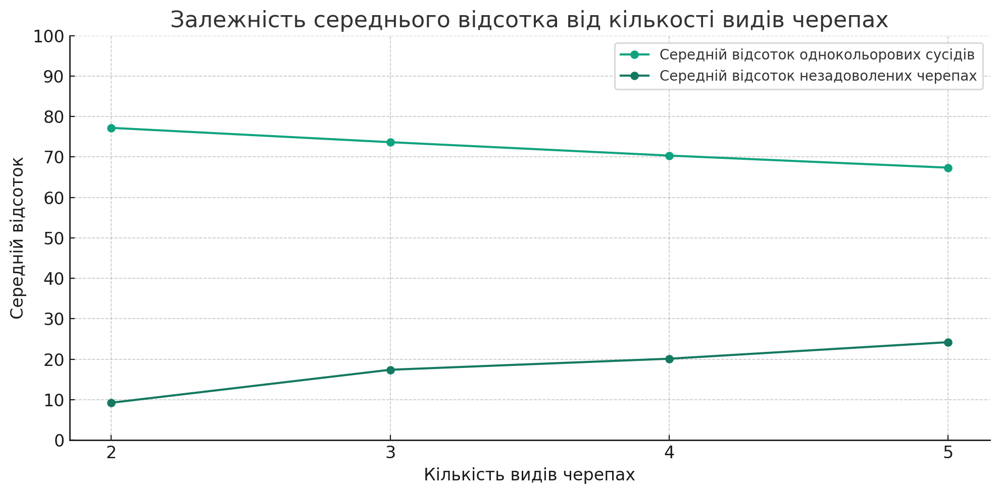

## Комп'ютерні системи імітаційного моделювання

## СПм-22-5, **Рибалов Олександр Олегович**

### Лабораторна робота №**2**. Редагування імітаційних моделей у середовищі NetLogo

 

### Варіант 8, модель у середовищі NetLogo:

[Segregation Simple Extension 1.](http://www.netlogoweb.org/launch#http://www.netlogoweb.org/assets/modelslib/IABM%20Textbook/chapter%203/Segregation%20Extensions/Segregation%20Simple%20Extension%201.nlogo)

 

### Внесені зміни у вихідну логіку моделі, за варіантом:

Додати можливість агенту зникнути, вірогідність чого залежить від кількості наявних поряд з ним "чужих" і кількості представників їхньої групи у їх власному оточенні. Виводити графік зміни розміру популяції.

Для цього було додані такі зміни

Додаткові Глобальні Змінні:

population-size: Відстежує загальну кількість черепах у моделі.
percent-similar-wanted: Визначає необхідний відсоток схожих сусідів для того, щоб черепаха вважалася щасливою.

<pre>
globals [
population-size ;; розмір популяції
percent-similar-wanted ;; необхідний відсоток схожих сусідів для щастя
]
</pre>

Додаткова Властивість Черепах:

disappearance-probability: Ймовірність зникнення черепахи в залежності від її соціального оточення.

<pre>
turtles-own [
disappearance-probability ;; ймовірність зникнення черепахи
]
</pre>

Додаткові Процедури:

update-population-size: Оновлює змінну population-size, відображаючи поточний розмір популяції.

check-for-disappearance: Перевіряє кожну черепаху на предмет можливого зникнення, використовуючи її disappearance-probability.

calculate-disappearance-probability: Розраховує disappearance-probability для кожної черепахи на основі кількості "чужих" сусідів порівняно з кількістю "своїх" сусідів.

<pre>
to update-population-size
set population-size count turtles
end
</pre>

<pre>
to check-for-disappearance
ask turtles [
calculate-disappearance-probability
if random-float 1 < disappearance-probability [ die ]
]
end
</pre>

<pre>
to calculate-disappearance-probability
let foreign-neighbors count (turtles-on neighbors) with [color != [color] of myself]
let same-neighbors count (turtles-on neighbors) with [color = [color] of myself]

set total-nearby foreign-neighbors + same-neighbors

;; Використання ifelse замість if
ifelse total-nearby > 0 [
set disappearance-probability (foreign-neighbors - same-neighbors) / total-nearby
] [
;; Якщо немає сусідів, можна встановити ймовірність зникнення як 0 або будь-яке інше базове значення
set disappearance-probability 0
]
end
</pre>

Змінена Логіка у Процедурі go:

Додано виклик check-for-disappearance у процедурі go, що дозволяє черепахам зникати під час кожного кроку моделювання.

<pre>
to go
check-for-disappearance
update-population-size
end
</pre>

Ці зміни розширюють модель, додаючи новий аспект динаміки популяції — зникнення черепах. Тепер модель не тільки відслідковує щастя черепах на основі їх соціального оточення, але й дозволяє черепахам зникати, що змінює загальний розмір популяції.

### Внесені зміни у вихідну логіку моделі, на власний розсуд:

Одна цікава зміна, це додавання фактору "соціального тяжіння" між черепахами одного кольору. Це може допомогти створити більш складні патерни руху та взаємодії між агентами. Ось як це можна реалізувати:

### Додавання Глобальної Змінної

<pre>
globals [
  ...
  attraction-factor ;; фактор притягання між черепахами одного кольору
  ...
]
</pre>

### Ініціалізація Нової Змінної

Встановимо цей фактор у процедурі setup:

<pre>
to setup
  ...
  set attraction-factor 0.1 ;; Припустимо, 0.1 як базове значення
  ...
end
</pre>

### Зміна Логіки Руху Незадоволених Черепах

Модифікуємо move-unhappy-turtles, щоб додати логіку притягання. Черепахи будуть мати тенденцію рухатися у напрямку більшої концентрації сусідніх черепах того ж кольору:

<pre>
to move-unhappy-turtles
  ask turtles with [not happy?] [
    let my-color color  ; зберігаємо колір поточної черепахи
    let target-patch max-one-of (neighbors) [
      count (turtles-here) with [color = my-color]
    ]

    if target-patch != nobody [
      face target-patch
      fd 1 + (attraction-factor * count (turtles-on target-patch) with [color = my-color])
    ]

    if any? other turtles-here [
      find-new-spot
    ]
    setxy pxcor pycor
  ]
end
</pre>

У цьому випадку, незадоволені черепахи будуть рухатися у напрямку патча, де знаходиться найбільша кількість черепах того ж кольору, що й вони. Швидкість руху залежить від кількості таких черепах, помноженої на attraction-factor.

Ця зміна не тільки впливає на поведінку черепах, але й може створювати більш цікаві та реалістичні патерни їхнього розподілу в моделі.

## Обчислювальні експерименти

### 1.Вплив кількості етносів(видів) на ступінь сегрегації:

Досліджується, як зміна кількості етносів впливає на рівень сегрегації.
Змінюю кількість етносів (NUMBER-OF-ETHNICITIES) в системі від 2 до 5 з кроком 1.
Інші керуючі параметри мають значення за замовчуванням:

-   **number**: 2000;
-   **%-simular-wanted**: 30;

<table>
<thead>
<tr><th>Кількисть видів черепах</th><th>Середній відсоток однокольорових сусідів</th><th>Середній відсоток незадоволених черепах</th></tr>
</thead>
<tbody>
<tr><td>2</td><td>77.20</td><td>9.25</td></tr>
<tr><td>3</td><td>73.66</td><td>17.40</td></tr>
<tr><td>4</td><td>70.35</td><td>20.13</td></tr>
<tr><td>5</td><td>67.36</td><td>24.22</td></tr>
</tbody>
</table>

 

Відповідно до цьго графіку можна зробити висновок, що зі збільшенням кількості видів черепах середній відсоток однокольорових сусідів знижується, тоді як середній відсоток незадоволених черепах зростає.
