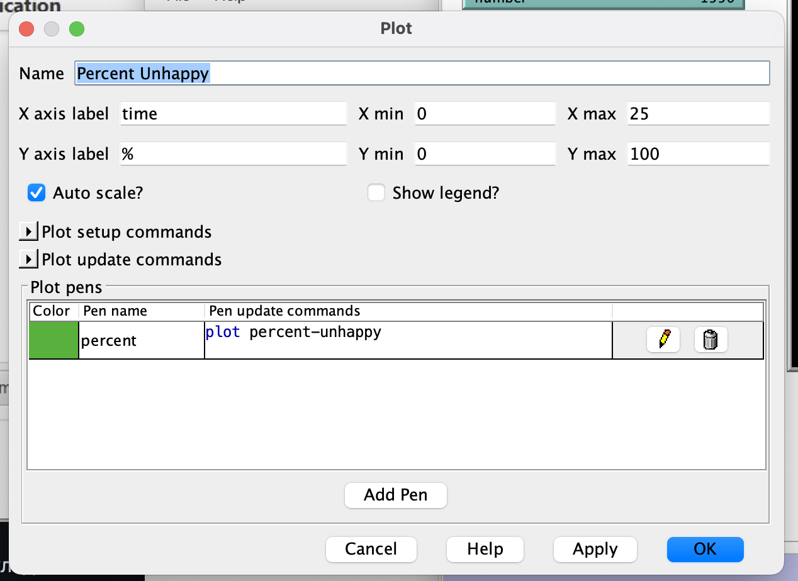
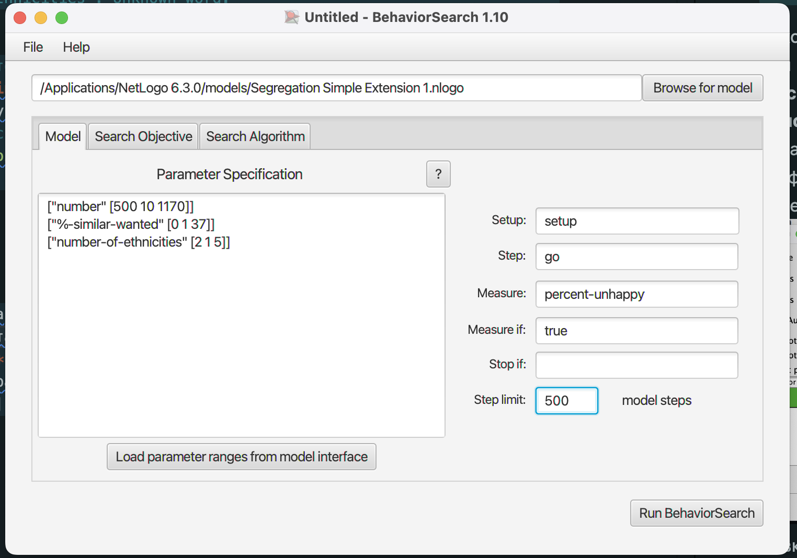
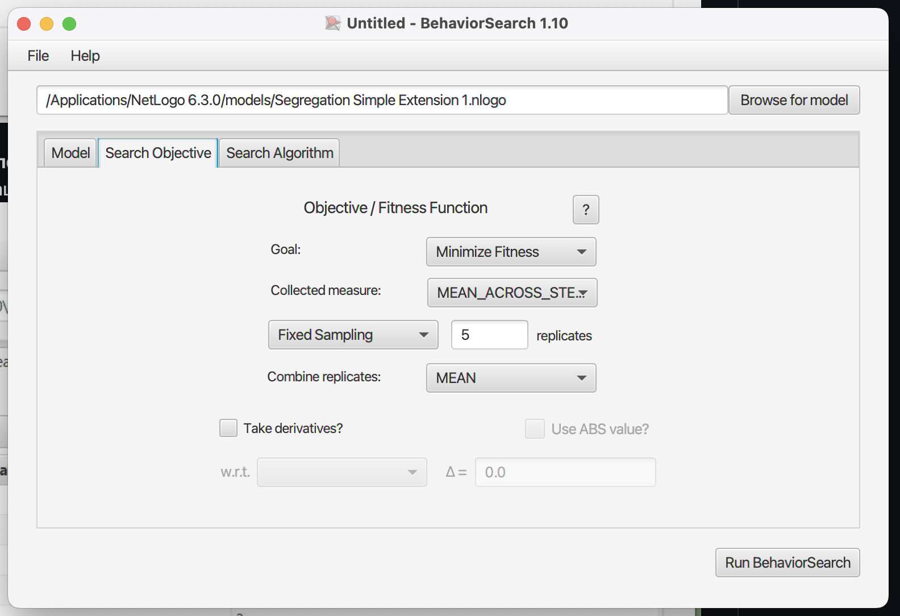
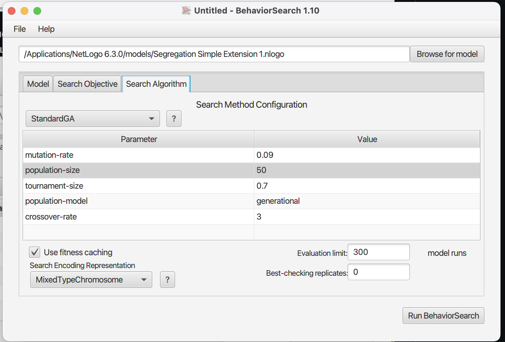
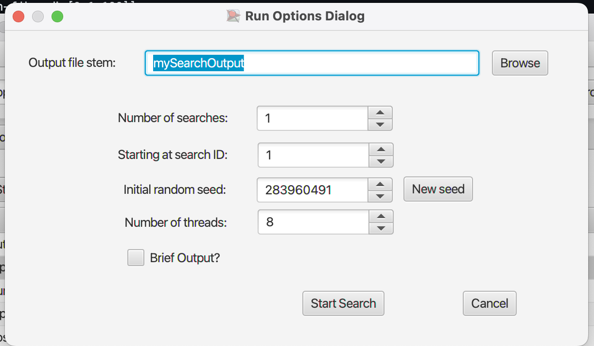
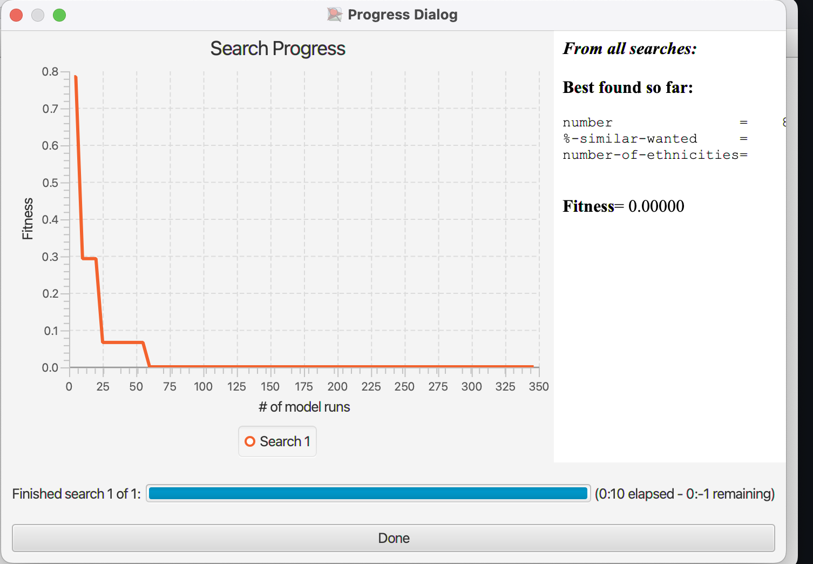
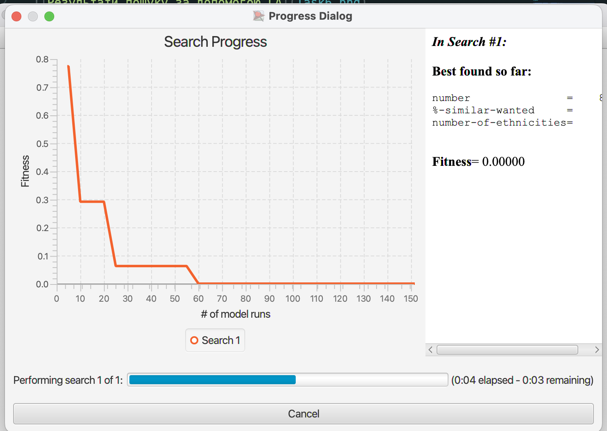
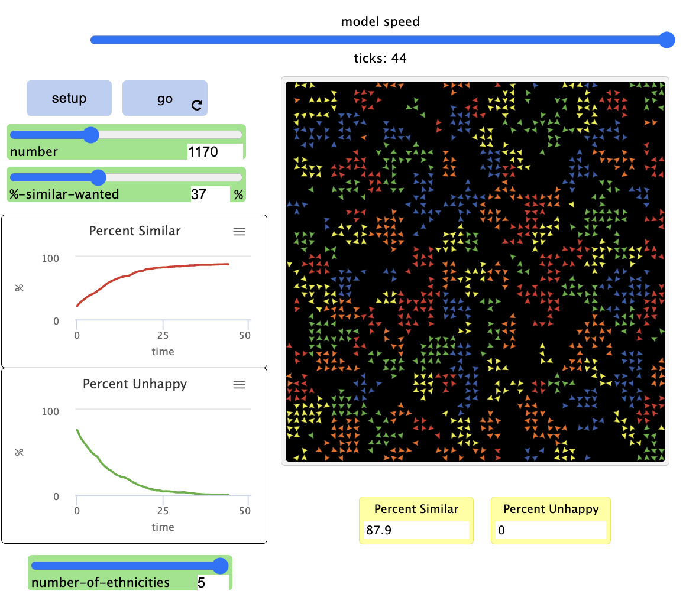

## Комп'ютерні системи імітаційного моделювання

## СПм-22-5, **Рибалов Олександр Олегович**

### Лабораторна робота №**3**. Використання засобів обчислювального интелекту для оптимізації імітаційних моделей

 

### Варіант 8, модель у середовищі NetLogo:

[Segregation Simple Extension 1.](http://www.netlogoweb.org/launch#http://www.netlogoweb.org/assets/modelslib/IABM%20Textbook/chapter%203/Segregation%20Extensions/Segregation%20Simple%20Extension%201.nlogo)

 

### Налаштування середовища BehaviorSearch:

**Обрана модель**:

<pre>
/Applications/NetLogo 6.3.0/models/Segregation Simple Extension 1.nlogo
</pre>

**Параметри моделі** (вкладка Model):

<pre>
["number" [500 10 2500]]
["%-similar-wanted" [0 1 100]]
["number-of-ethnicities" [2 1 5]]
</pre>

Використовувана **міра**:  
Для фітнес-функції було обрано **середній відсоток черепах, які мають менше однокольорових сусідів, ніж вони бажають**, вираз для її розрахунку взято з налаштувань графіка аналізованої імітаційної моделі в середовищі NetLogo  
  
та вказано у параметрі "**Measure**":

<pre>
percent-similar
</pre>

Середній відсоток черепах повиннен враховуватися **в максимальній** за весь період симуляції тривалістю, 500 тактів , починаючи з 0 такту симуляції.  
Параметр зупинки за умовою ("**Stop if**") у разі не використовувався.  
Загальний вигляд вкладки налаштувань параметрів моделі:  

**Налаштування цільової функції** (вкладка Search Objective):  
Метою підбору параметрів імітаційної моделі, що втілює взаємодію черепах різних видів в середовищі біля уявного ставу., є **мінімізація** відсотка нещасливих черепах – це вказано через параметр "**Goal**" зі значенням **Minimize Fitness**. При цьому цікавить не просто середне значення нещасливих черепах, а її мінімальне значення на протязі всієї симуляції (тривалість якої (500 кроків) вказувалася на минулій вкладці). Для цього у параметрі "**Collected measure**", що визначає спосіб обліку значень обраного показника, вказано **MEAN_ACROSS_STEPS**.
Щоб уникнути викривлення результатів через випадкові значення, що використовуються в логіці самої імітаційної моделі, **кожна симуляція повторюється по 5 разів**, результуюче значення розраховується як **середнє арифметичне**.
Загальний вигляд вкладки налаштувань цільової функції:

**Налаштування алгоритму пошуку** (вкладка Search Algorithm):
Загальний вид вкладки налаштувань алгоритму пошуку:

 
### Результати використання BehaviorSearch:
Діалогове вікно запуску пошуку *(можна залишити за замовчуванням, але стежте, куди пишеться результат)*:

Результат пошуку параметрів імітаційної моделі, використовуючи **генетичний алгоритм**:  

Результат пошуку параметрів імітаційної моделі, використовуючи **випадковий пошук**:  

Робота моделі у середовищі NetLogo з парметрами:

